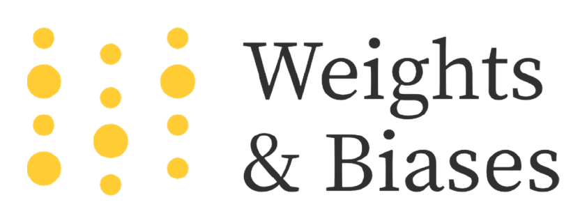
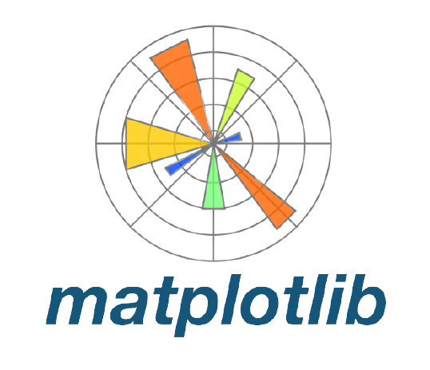

Results-oriented Geoinformatics Engineer with a solid academic background and experience in applied Deep Learning techniques for various earth observation applications. Proven ability to implement efficient deep neural network architectures for fully automated object detection, semantic segmentation and instance segmentation tasks.

### :hammer_and_wrench: Languages and Tools:  

<kbd></kbd>
<kbd></kbd>
<kbd></kbd>
<kbd></kbd>
<kbd></kbd>
<kbd></kbd>
<kbd></kbd>
<kbd></kbd>
<kbd></kbd>
<kbd></kbd>

### :books: Python Libraries:

<kbd></kbd>
<kbd></kbd>
<kbd></kbd>

<kbd></kbd>
<kbd></kbd>
<kbd></kbd>
<kbd></kbd>

<kbd></kbd>
<kbd></kbd>
<kbd></kbd>
<kbd></kbd>

<kbd></kbd>
<kbd></kbd>
<kbd></kbd>
<kbd></kbd>
