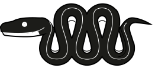

I am a Geoinformatics Engineer specializing in applied deep learning techniques for earth observation applications. My expertise lies primarily on developing efficient operational pipelines for various earth observation tasks, and I’m involved in both academic and research roles, particularly in remote sensing and computer vision.

  

#### Languages & Tools
<table border="0" cellpadding="0" cellspacing="0" style="border-collapse: collapse; border: none;">
  <tr style="border: none;">
    <td style="border: none;"></td>
    <td style="border: none;"></td>
    <td style="border: none;"></td>
    <td style="border: none;"></td>
    <td style="border: none;"></td>
    <td style="border: none;"></td>
    <td style="border: none;"></td>
    <td style="border: none;"></td>
    <td style="border: none;"></td>
    <td style="border: none;"></td>
    <td style="border: none;"></td>
    <td style="border: none;"></td>
    <td style="border: none;"></td>
    <td style="border: none;"></td>
    <td style="border: none;"></td>
    <td style="border: none;"></td>
  </tr>
</table>

#### ML/DL Frameworks 
<table>
  <tr>
    <td></td>
    <td></td>
    <td></td>
    <td></td>
    <td></td>
    <td></td>
    <td></td>
  </tr>
</table>

#### Software
<table>
  <tr>
    <td></td>
    <td></td>
    <td></td>
    <td></td>
    <td></td>
    <td></td>
  </tr>
</table>
